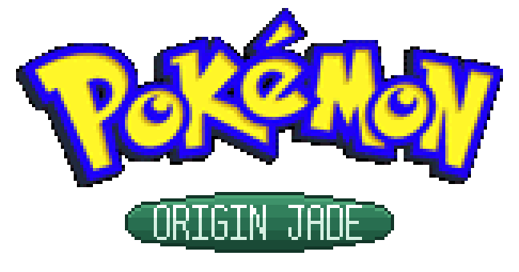

<p align="center">
  
</p>

<!-- Title screen goes here -->

**Pokémon Origin Jade** is a ROM hack built on
[Pokémon HnS](https://github.com/PokemonHnS-Development/pokehns-expansion),
which itself builds on
[`pokeemerald-expansion`](https://github.com/rh-hideout/pokeemerald-expansion).

The idea: **one continuous journey across three regions.** After Johto and
Kanto, the road leads on to **Hoenn** — not as a separate game, but as the same
story continued, with the same team and the same save file.

---

## The premise

You arrive in Hoenn as the **Champion of the mainland**, invited by Steven
Stone. That single fact changes everything about the Emerald opening. Nobody
explains how to catch a Pokémon. Nobody treats you as a beginner. People who
know you know exactly who you are — and those who don't have only heard
rumours.

The entire early game was rebuilt around this: no moving van, no starter
choice, no tutorials.

---

## What's different

### HMs are tied to Gym Badges

You bring your HMs with you from Johto and Kanto — but in Hoenn you may only
use them once you hold the matching Badge.

| Badge | Gym | Unlocks |
|---|---|---|
| Stone Badge | Rustboro City | Cut |
| Dynamo Badge | Mauville City | Rock Smash |
| Heat Badge | Lavaridge Town | Strength |
| Balance Badge | Petalburg City | Surf |
| Mind Badge | Mossdeep City | Dive |
| Rain Badge | Sootopolis City | Waterfall |

**Flash and Fly need no permission** — you already have them, and Hoenn does
not hand them out again.

### Difficulty that matches the point in the story

Hoenn is endgame content and plays like it. All eight Gym Leaders field **six
Pokémon** — in every rematch tier as well — carry six held items and bring Full
Restores. Every Gym is mono-type. Wild Pokémon and Trainers scale with your
progress, and Trainer Pokémon evolve along with the scaling.

### Characters with a history

**Steven** brought you to Hoenn. What he's actually doing there, he won't say.
**May** takes you as her benchmark and grows measurably stronger across five
encounters — from three Pokémon to a full team. **Norman** is a Gym Leader, not
your father, and only contacts you once his Gym reopens.

### Quality of life

- No duplicate item handouts — anything you already earned on the mainland is
  skipped, with a runtime check that respects the reusable-TM setting
- Field items unified: every Poké Ball and Great Ball is an **Ultra Ball**,
  every Potion and Super Potion a **Hyper Potion**
- The PokéCom (PokéNav) fully reworked: correct locations, correct call timing,
  Elite Four contacts, renamed throughout
- Trainer tip signs replaced with location flavour text

### Language

German is complete and is the language the project is developed in. **English
is planned as a full second language**, so the final release will ship with at
least German and English.

---

## Building

```bash
make jade
```

The result is `Pokemon_Origin_Jade.gba`.

Setup and prerequisites are described in [`INSTALL.md`](INSTALL.md). To build
without the Hoenn content, use `make hns`.

> ❗ Please do **not** use GitHub's "Download ZIP" button — it omits the commit
> history, which you need in order to pull updates later.

---

## Roadmap

### Recently done

- [x] Engine update merged from the active HnS main repo (41 upstream
      commits): no more dex softlocks (every species is catchable wild or
      via repeatable statics), new fly locations with map icons, IVs from
      1.2, the GS Ball / Celebi event, fixed evolution methods, Amulet
      Coin and nurse-facing fixes, a rebalanced Arceus finale, party-limit
      protections and a stack of crash fixes — while Origin Jade's own
      badge-permission system for HMs remains fully in charge (the
      upstream HM overhaul now routes Surf and Waterfall through it too)

- [x] Secret base battles no longer crash — the special secret-base trainer
      ID hit two unguarded lookups ("invalid trainer: 65280", then a level-0
      glitch opponent); both now handle it the vanilla way
- [x] HGSS berry trees yield a random 1-5 berries per harvest instead of a
      constant maximum
- [x] The Secret Power man on Route 111 no longer hands out a duplicate
      TM43 — he recognises the Champion already carries it and just points
      out where to use it
- [x] The PC belongs to Bill — once you've met him at the Sea Cottage,
      the storage box is labeled "Bill's PC" everywhere (menu, transfer
      messages, catch screen); before that it stays "Someone's PC", just
      like the classic logic. Lanette stays in Fallarbor with a new role:
      she helped develop Bill's system and contributed the pretty box
      wallpapers

- [x] Twins Irm & Ida field four Pokémon in every rematch tier (a double
      battle with an odd-numbered team looked off), and the TV interviewers
      Gabby & Ty now bring Plusle and Minun along — four Pokémon per tier
      instead of two
- [x] Wally's dialogue keeps up with his team — battle lines no longer name
      Ralts as his current partner (level scaling evolves it), while the
      story of catching it together stays untouched

- [x] Nuzlocke works in Hoenn — the encounter-tracking table only covered
      Johto/Kanto in this build (every Hoenn route silently shared one bit
      with Johto's Route 1); all 102 Hoenn areas now have their own bits in
      a new save field, fully save-compatible
- [x] Pre-emptive progression audit tool — a repeatable scan that flags
      every Hoenn script checking a flag or variable the Champion already
      carries from Johto/Kanto, and understands the build's #if branches;
      first full run done, remaining findings triaged
- [x] Rival scene polish — Route 103's first battle always uses May's fixed
      team line, and the rival encounter theme on Routes 110/119 is always
      May's (female players heard Brendan's)

- [x] The Rock Smash Dude in Mauville speaks Champion — no more HM tutorial;
      he notes you already carry HM Rock Smash and reminds you that in
      Hoenn it takes Wattson's Dynamo Badge to use it

- [x] Rival consistency on Route 110 — May's bike sprite is now forced for
      the rival's departure too (female players saw Brendan's bike), and the
      Itemfinder handover is retired: the Champion has carried one since
      Johto, and May's dialogue acknowledges exactly that

- [x] Trainer payouts now scale with the endgame — prize money is calculated
      from the level you actually fought (the scaled team), not the low
      ROM-level from the party file; a routine trainer battle pays like the
      endgame fight it is
- [x] Save-screen badge counter fixed for real (Johto 8 + Kanto 8 + Hoenn,
      no more double-counted Kanto badges)

- [x] Call-window text width fixed for real — the field call popup draws the
      wait arrow after the last character, so every call line (match calls
      AND scripted pokenavcalls in map scripts) is now wrapped to 182 px;
      no more clipped letters or missing arrows
- [x] Scott stays a mystery — he is "???" at the Trainers' School and on the
      Slateport docks, and only gives his name the moment he registers
      himself in your PokéCom (no more introducing himself twice)
- [x] Flying to Littleroot now lands in front of Prof. Birch's lab instead
      of inside the player's old bedroom
- [x] The obsolete Route 110 PokéCom registration scene with Prof. Birch is
      retired — he has been registered since the arrival scene

- [x] Hoenn berry system — Emerald's full berry cultivation is back in Hoenn
      (soft loamy soil, planting your own berries, watering with the Wailmer
      Pail from the Route 104 flower shop, per-berry growth times), while
      Johto keeps its HGSS self-replanting trees; the two systems now
      coexist through runtime region branches

- [x] Prof. Birch handover scene — the Badge Case unlocks the Hoenn badge row
      on the Trainer Card, with a catch-up fallback for existing saves
- [x] Elite Four rematches — after the Hoenn League win, every member fields a
      rematch team with evolved rosters (Weavile, Dusknoir, Mismagius,
      Froslass, Dragonite …); the engine locks were removed
- [x] Hoenn Elite Four as a standalone Elite Four — first-battle intros now
      recognise the two-region Champion instead of greeting a rookie
- [x] PokéCom call texts (Steven, May, Wally, Scott, Mr. Stone) — canon pass
      (no more "Norman's child", no move tutorials for a Champion) and a full
      reflow of every call to the app window's real 192 px text width
- [x] Gen 3 starters placed in the wild — Mudkip (Route 102), Treecko
      (Petalburg Woods), Torchic (Route 113), each as a 1 % encounter
- [x] Post-game gating rebuilt — "story complete" checks now use a dedicated
      Hoenn Champion flag instead of the game-clear flag the player already
      carries from Johto/Kanto (fixes the Devon Goods dead end, the S.S. Tidal
      running from day one, Trainer Hill, Altering Cave, Trick House finale
      and 30+ more spots)
- [x] All Hoenn city marts stock the endgame lineup (Ultra Balls, Hyper/Max
      Potions, Full Restores …) — you arrive as a Champion, shops act like it
- [x] Pokémon Center heal animation restored in Hoenn (a sprite priority bug
      hid the balls behind the map — Johto was unaffected)
- [x] Badge count on the save screen now sums the whole career: Johto + Kanto
      + Hoenn
- [x] The bedroom wall map (and every {REGION} text) is location-aware — it
      says Hoenn in Hoenn
- [x] English branches repaired: STEVEN instead of TROY, MAY instead of
      BRENDAN, ready for the English build
- [x] Held-item parity: all Gym Leader rematch tiers and the Elite Four carry
      six held items

### In progress

- [ ] Playtest pass through Hoenn — Dewford onward
- [ ] Origin Jade credits — the official German Emerald left its credits in
      English, so only the Origin Jade-specific credits remain to be decided

### Planned: the full journey

The long-term goal is to start the game in **Kanto**, in its first-generation
form, and travel Kanto → Johto → Hoenn in that order — the route the anime
takes.

- [ ] Replace HnS's Kanto with the FRLG map (186 maps out, 260 in)
- [ ] Restore FRLG wild encounter tables — currently almost entirely absent
- [ ] Make all 151 Gen 1 species obtainable, no version exclusives
- [ ] Join the maps at Route 22, the seam both regions already share
- [ ] Indigo Plateau as one location with two states — Kanto league, then Johto
- [ ] Extend flag storage into SaveBlock3 (around 12,500 spare flags available)
- [ ] Prof. Elm's starter scene, rewritten for an arriving Kanto Champion
- [ ] Raise Johto's level curve and team sizes to match
- [ ] Steven's ticket chain, relocated onto the FRLG maps

### Under consideration

- [ ] Bigger trainer teams from Route 110/111 onward (more than three
      Pokémon per trainer) so the mid-game doesn't rush by — deliberately
      parked until the HnS full release, because the final level curve
      decides whether longer fights at equal level feel right

- [ ] Randomizer fine-tuning — the hook inventory is done and came back
      clean (wild, trainer, gift, static and egg randomization all run
      through central hooks, so Hoenn is covered); remaining checks are
      whitelist coverage for species 252+ and the interaction order with
      level scaling
- [ ] Open sea routes between regions — custom surf routes with their own
      maps, trainers and encounters connecting Cinnabar↔Lilycove and
      Johto↔Hoenn, so the regions link up in the overworld instead of only
      by ferry (prototype planned after the HnS full release)
- [ ] More Gen 4 Pokémon — the engine already carries all Gen 4+ species
      data; step one is enabling the remaining Gen 4 evolutions of older
      lines (items + dex visibility), step two grows the Neu-Sinjoh area
      with Sinnoh species; a full Platinum integration is out of scope
- [ ] Trainer-defeat flags moved to spare save space — would lift the
      7-free-trainer-ID limit and unlock full four-tier Elite Four ladders
      without breaking saves by relayout

- [ ] Four-tier Elite Four rematch ladders — currently one tier per member,
      because only seven free trainer IDs remain before the trainer-flag
      space overflows; a full ladder (20 IDs) needs a save-breaking flag
      relayout, so it waits for a deliberate save-break window
- [ ] Fifth badge-rematch tier colour on the Trainer Card (diamond palette)
- [ ] Region name as a watermark in the map graphics
- [ ] Default setting for the "Faster Joy" quick-heal option

### Held back until the HnS full release

These are finished but not merged, to avoid conflicts with HnS's ongoing beta.

- [ ] Steven's ticket chain in Vermilion, New Bark and Silph Co.
- [ ] Remove Gen 3 species from Johto and Kanto (93 slots across 32 maps)
- [ ] Fuchsia Safari Zone — switch to Gen 4, Cynthia in place of Steven

---

## Credits

This project stands on other people's work:

- **[Pokémon HnS](https://github.com/PokemonHnS-Development/pokehns-expansion)**
  — the Johto and Kanto foundation everything is built on
- **[`hns_de`](https://github.com/helikoptermann843/hns_de)** — the German
  localisation of HnS, and the source for the German text of Johto and Kanto
- **[RHH's `pokeemerald-expansion`](https://github.com/rh-hideout/pokeemerald-expansion)**
  — the engine and its hundreds of features
- **[pret's `pokeemerald`](https://github.com/pret/pokeemerald)** — the
  decompilation project that started it all

```
Based off RHH's pokeemerald-expansion https://github.com/rh-hideout/pokeemerald-expansion/
```

Everyone who contributed to the engine is listed in [`CREDITS.md`](CREDITS.md).

---

## Legal

Pokémon is a registered trademark of Nintendo, Game Freak and The Pokémon
Company. This is a non-commercial fan project with no affiliation to the
rights holders. **No ROM image is distributed** — the source is built locally.
